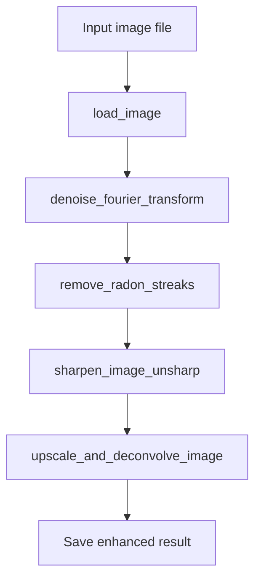
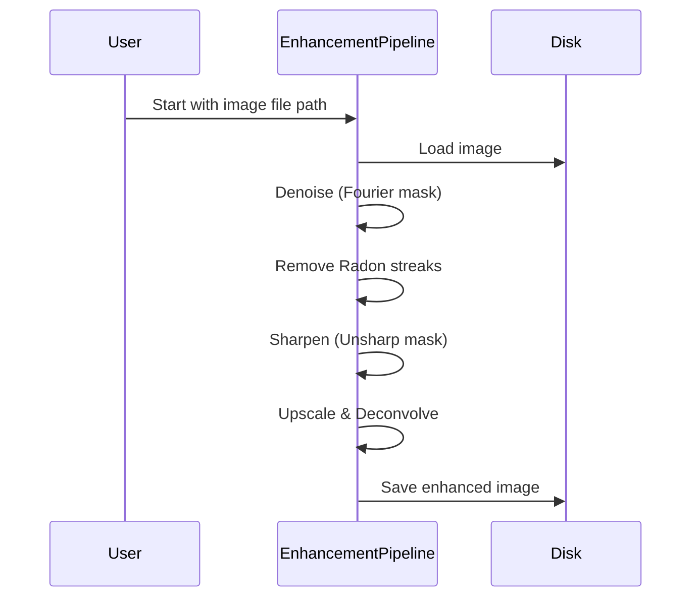

# 🖼️ Image Processing Utilities Documentation

This documentation covers two Python modules: `error-metrics.py` and `reconstruction.py`. Both modules provide essential tools for image analysis and restoration. Read on for detailed explanations, workflows, and usage.

---

## error-metrics.py

This module provides utilities for quantitatively comparing two images. It computes standard error metrics commonly used in image processing and computer vision.

### Main Features

- **Image loading & conversion to grayscale**
- **Calculation of image error metrics:**
  - Mean Squared Error (MSE)
  - Root Mean Squared Error (RMSE)
  - Peak Signal-to-Noise Ratio (PSNR)
  - Structural Similarity Index (SSIM)
- **Automatic resizing for metric compatibility**
- **Command-line interface for quick metric evaluation**

---

### 📦 Functions Overview

| Function             | Description                                                               |
|----------------------|---------------------------------------------------------------------------|
| `load_img`           | Loads an image, converts to grayscale, normalizes to float [0,1]          |
| `calc_mse`           | Computes the Mean Squared Error between two images                        |
| `calc_rmse`          | Computes RMSE between two images                                          |
| `calc_psnr`          | Computes the PSNR between two images                                      |
| `eval_ssim`          | Computes the SSIM between two images                                      |
| `run_img_comp_metrics` | Loads two images and prints all error metrics                            |

---

### 🧩 Code Architecture

#### High-Level Workflow

```mermaid
flowchart TD
    A[User defines image paths] --> B[run_img_comp_metrics]
    B --> C[load_img (original)]
    B --> D[load_img (compressed)]
    C --> E[calc_mse]
    D --> E
    E --> F[calc_rmse]
    E --> G[calc_psnr]
    E --> H[eval_ssim]
    F --> I[Print Results]
    G --> I
    H --> I
```

---

### Function Details

#### `load_img(img_path)`

- Loads a grayscale, float-precision image from disk.
- Handles RGB and grayscale files.
- Prints shape and dtype info.

```python
def load_img(img_path):
    ...
```

#### `calc_mse(img1, img2)`

- Computes pixel-wise Mean Squared Error.
- Resizes images if shapes differ.

```python
def calc_mse(img1, img2):
    ...
```

#### `calc_rmse(img_a, img_b)`

- Calculates RMSE using the MSE function.

```python
def calc_rmse(img_a, img_b):
    ...
```

#### `calc_psnr(img_one, img_two)`

- Calculates the Peak Signal-to-Noise Ratio in dB.
- Handles identical images as a special case.

```python
def calc_psnr(img_one, img_two):
    ...
```

#### `eval_ssim(img_src, img_tgt)`

- Uses the SSIM metric from scikit-image.
- Resizes if dimensions do not match.

```python
def eval_ssim(img_src, img_tgt):
    ...
```

#### `run_img_comp_metrics()`

- Reads two images and prints all metrics.

---

### Typical Usage

To use this module:

1. Set the paths in `orig_img_loc` and `comp_img_loc` inside `run_img_comp_metrics()`.
2. Run the script.

**Example Output:**

```
--- Image Comparison Results ---
MSE ('original.png' vs 'compressed.png'): 0.0032
RMSE: 0.0566
PSNR: 32.12 dB
SSIM: 0.92
-----------------------------------
```

---

### Error Metric Definitions

| Metric    | Description                                                   | Output Range       |
|-----------|----------------------------------------------------------------|--------------------|
| MSE       | Mean squared pixel error                                      | 0 (identical) +    |
| RMSE      | Square root of MSE                                            | 0 (identical) +    |
| PSNR      | Ratio of max signal to noise (in dB)                          | 0 - inf; higher=better |
| SSIM      | Structural similarity (perceptual)                            | -1 to 1; 1=identical   |

---

### 🟡 Notes and Recommendations

```card
{
    "title": "Metric Limitations",
    "content": "Always inspect images visually in addition to metrics—numbers alone can't capture all quality differences."
}
```

---

## reconstruction.py

This module provides a **pipeline for image restoration and enhancement**. It applies several advanced techniques to denoise, deblur, sharpen, and upscale grayscale images.

### Main Features

- **Image loading & normalization**
- **Fourier-based denoising**
- **Radon streak removal (sinogram smoothing)**
- **Unsharp masking for sharpening**
- **Upscaling + Wiener deconvolution to enhance resolution**
- **Batch pipeline for automated enhancement**

---

### 📦 Functions Overview

| Function                       | Description                                                 |
|--------------------------------|-------------------------------------------------------------|
| `load_image`                   | Load and normalize image                                    |
| `denoise_fourier_transform`    | Denoise using a low-pass mask in the frequency domain       |
| `remove_radon_streaks`         | Remove streak artifacts using Radon transform and median filtering |
| `sharpen_image_unsharp`        | Enhance edges via unsharp masking                           |
| `upscale_and_deconvolve_image` | Upscale and restore sharpness via Wiener deconvolution      |
| `run_image_enhancement_pipeline` | Orchestrates the full pipeline; saves result               |

---

### 🧩 Pipeline Architecture

#### Image Enhancement Pipeline



---

### Function Details

#### `load_image(file_path)`

- Reads an image, converts to grayscale, and normalizes to [0,1].

```python
def load_image(file_path):
    ...
```

#### `denoise_fourier_transform(input_img)`

- Applies a low-pass circular mask in the frequency domain to suppress high-frequency noise.
- Uses FFT for fast computation.

```python
def denoise_fourier_transform(input_img):
    ...
```

#### `remove_radon_streaks(input_img)`

- Computes the Radon transform (sinogram).
- Median-filters the sinogram to suppress streak artifacts.
- Reconstructs the image using the inverse Radon transform.

```python
def remove_radon_streaks(input_img):
    ...
```

#### `sharpen_image_unsharp(original_img)`

- Enhances edges using unsharp masking (subtracts a Gaussian-blurred version).
- Increases detail contrast.

```python
def sharpen_image_unsharp(original_img):
    ...
```

#### `upscale_and_deconvolve_image(low_res_img, scale_factor=2)`

- Upscales the image using interpolation.
- Simulates a point spread function (PSF) and applies Wiener deconvolution to restore detail.

```python
def upscale_and_deconvolve_image(low_res_img, scale_factor=2):
    ...
```

#### `run_image_enhancement_pipeline()`

- Executes the above steps in sequence.
- Saves the enhanced output image.

---

### Typical Usage

1. Set `in_file` to your input image path in `run_image_enhancement_pipeline()`.
2. Optionally, adjust `out_file` for the output location.
3. Run the script.

---

### 🧑‍🔬 Algorithm Summary Table

| Stage                       | Purpose                               | Techniques Used                 |
|-----------------------------|---------------------------------------|---------------------------------|
| Denoising                   | Reduce high-frequency noise           | Fourier transform, masking      |
| Radon streak removal        | Remove linear artifacts, stripes      | Radon transform, median filter  |
| Sharpening                  | Enhance edges                         | Unsharp masking, Gaussian blur  |
| Upscale & Deconvolution     | Restore lost detail after upscaling   | Wiener filter, PSF modeling     |

---

### 📈 Data Flow Example



---
